# Splitgood - Expense Splitting Application

## Overview

Splitgood is a production-ready expense splitting web application (similar to Splitwise) built with Django and vanilla HTML/CSS/JS. Users can track shared expenses, manage group balances, and settle debts with friends, roommates, and trip companions.

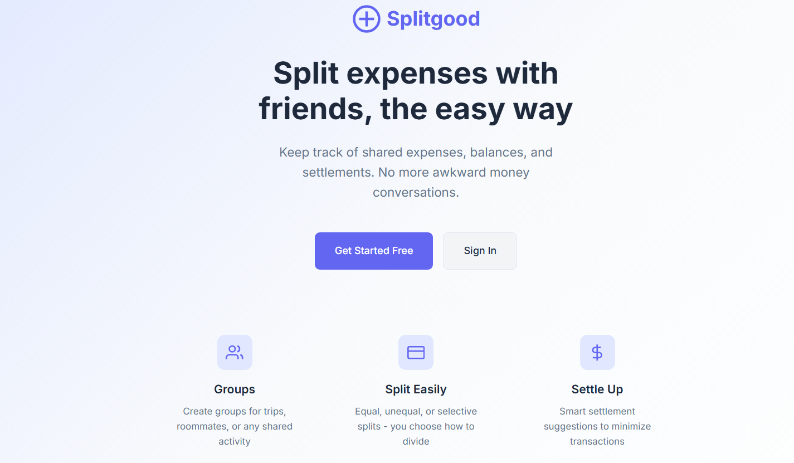

**Core Features:**
- User authentication with email-based accounts
- Groups for organizing expense sharing
- Expense tracking with multiple split types (equal, unequal, percentage-based)
- Balance calculations and optimal settlement suggestions
- Activity feed and payment history
- Group invitations and member management
- Beautiful responsive UI with indigo/purple theme
- RAW/UNIFIED currency toggle with live FX rates and passive sign detection


## System Architecture

### Backend Architecture

**Framework:** Django with server-rendered templates
- Primary application logic in the `core` Django app
- Uses Django's built-in authentication with a custom User model (UUID primary keys)
- Server-side rendering with Django templates (located in `templates/`)
- Minimal JavaScript for progressive enhancement (`static/js/main.js`)

**Database Models:**
- `User` - Extended AbstractUser with profile fields (display_name, currency, timezone, avatar_color)
- `Group` - Expense sharing groups with ownership and settings
- `GroupMembership` - Many-to-many relationship with roles (admin/member) and invitation status
- `Expense` - Individual expenses with split type configuration
- `ExpenseShare` - How each expense is divided among participants
- `Payment` - Settlement payments between users
- `Comment` - Threaded comments on expenses
- `Activity` - Audit log for group actions
- `GroupInvite` - Pending group invitations

**Split Strategies Supported:**
- Equal split among selected participants
- Unequal/custom amounts per participant
- Percentage-based splits

### Frontend Architecture

**Django Templates:**
- Full-featured responsive UI in `templates/`
- Base template with navigation and common elements
- Dedicated templates for auth, dashboard, groups, expenses, profile
- Custom CSS in `static/css/styles.css` with CSS variables for theming
- Progressive enhancement JavaScript in `static/js/main.js`

### URL Routes

**Authentication:**
- `/auth/login/` - Login page
- `/auth/signup/` - Registration page
- `/auth/logout/` - Logout action
- `/profile/` - User profile management

**Main Application:**
- `/` - Landing page (unauthenticated) or redirects to dashboard
- `/dashboard/` - User dashboard with balance, groups, activity
- `/groups/` - List of user's groups
- `/groups/create/` - Create new group
- `/groups/<uuid>/` - Group detail page
- `/groups/<uuid>/edit/` - Edit group
- `/groups/<uuid>/expenses/add/` - Add expense
- `/groups/<uuid>/expenses/<uuid>/` - Expense detail
- `/groups/<uuid>/settle/` - Record settlement payment

### Data Storage

**Primary Database:** PostgreSQL
- Django ORM for all database operations
- UUID primary keys for all models (better for distributed systems)
- Database migrations managed by Django (`core/migrations/`)

### Running the Application

The application is started via `python manage.py runserver` which spawns the Django development server:
```bash
python manage.py runserver 0.0.0.0::8000
```

**Management Commands:**
- `python manage.py migrate` - Apply database migrations
- `python manage.py seed_data` - Seed demo data (5 users, 2 groups, 11 expenses)
- `python manage.py collectstatic` - Collect static files for production

## Environment Variables Required

- `DATABASE_URL` - PostgreSQL connection string or custom PGUSER, PGPASSWORD, PGHOST, PGPORT manually setted in .env file.
- `SESSION_SECRET` - Django secret key (falls back to insecure dev key if not set)

## Project Structure

```
├── core/                   # Main Django app
│   ├── models.py          # Data models (User, Group, Expense, etc.)
│   ├── views.py           # View functions
│   ├── forms.py           # Django forms
│   ├── urls.py            # URL routing
│   ├── admin.py           # Admin site configuration
│   └── management/        # Custom management commands
├── splitgood/             # Django project settings
│   ├── settings.py        # Project configuration
│   └── urls.py            # Root URL configuration
├── templates/             # Django templates
│   ├── base.html          # Base template
│   ├── auth/              # Authentication templates
│   └── core/              # App templates (dashboard, groups, etc.)
├── static/                # Static assets
│   ├── css/styles.css     # Main stylesheet
│   ├── js/main.js         # JavaScript enhancements
│   └── js/currency_toggle.js  # RAW/UNIFIED toggle logic
├── manage.py              # Django CLI

```

## Project Features:

## Dashboard UI:
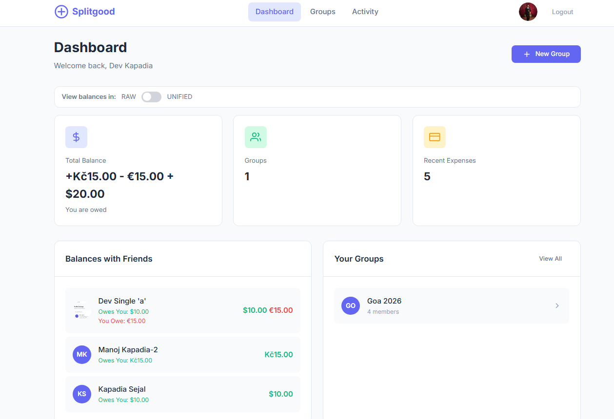

## Group UI :

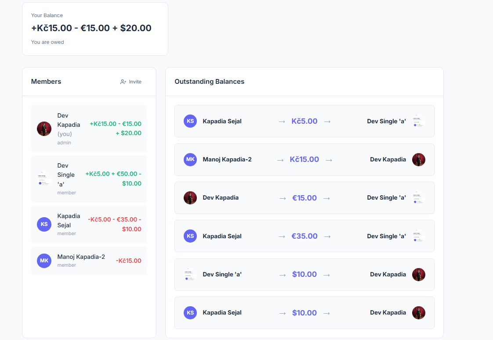

## Profile Section:

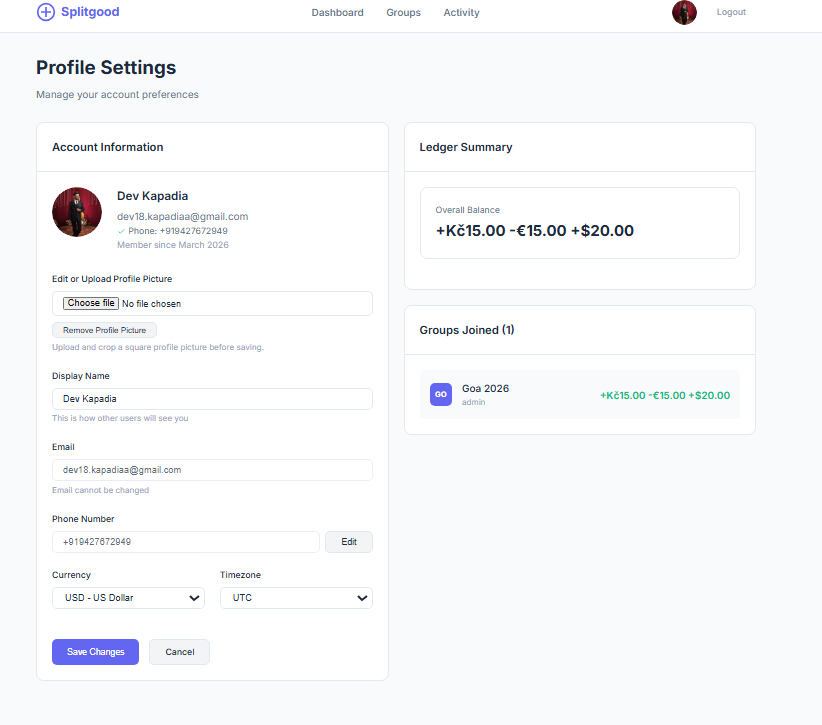

## Individual Expense Summary:

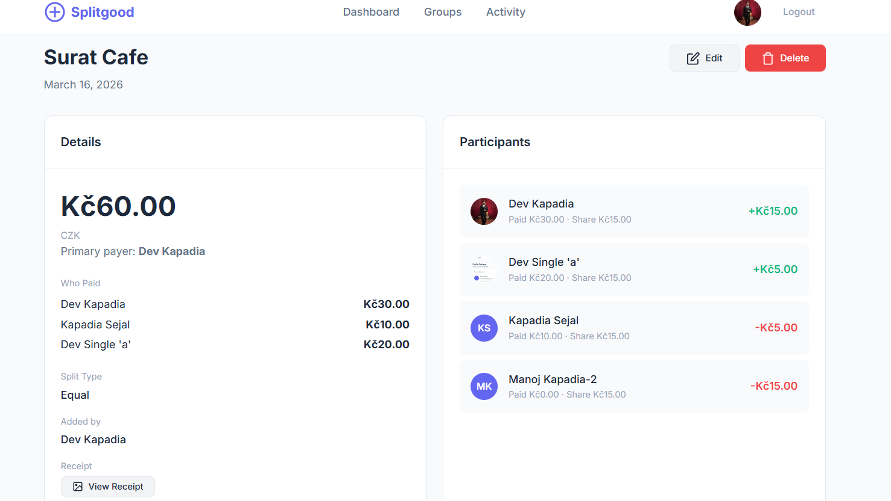

## Recent Activity Section:

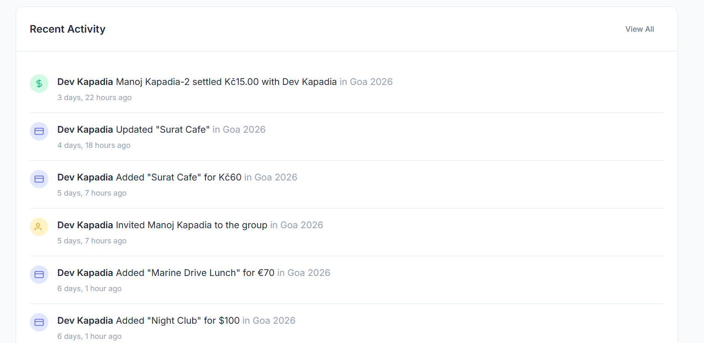

## Multipayer Split of Expenses:

1. Multi payers' contributions & Equal Split share:
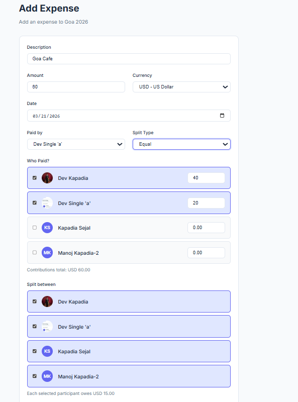

2. Multi payers' contributions & Unequal Split share:
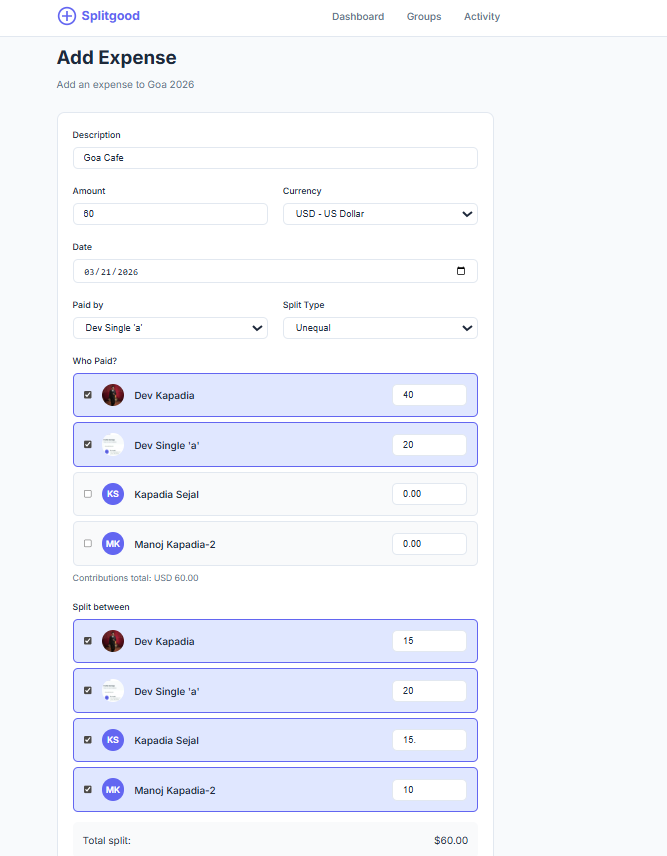

## Settle up feature:


## Unified Payment Representation from the Multi-currency expenses:

1. Dashboard View:
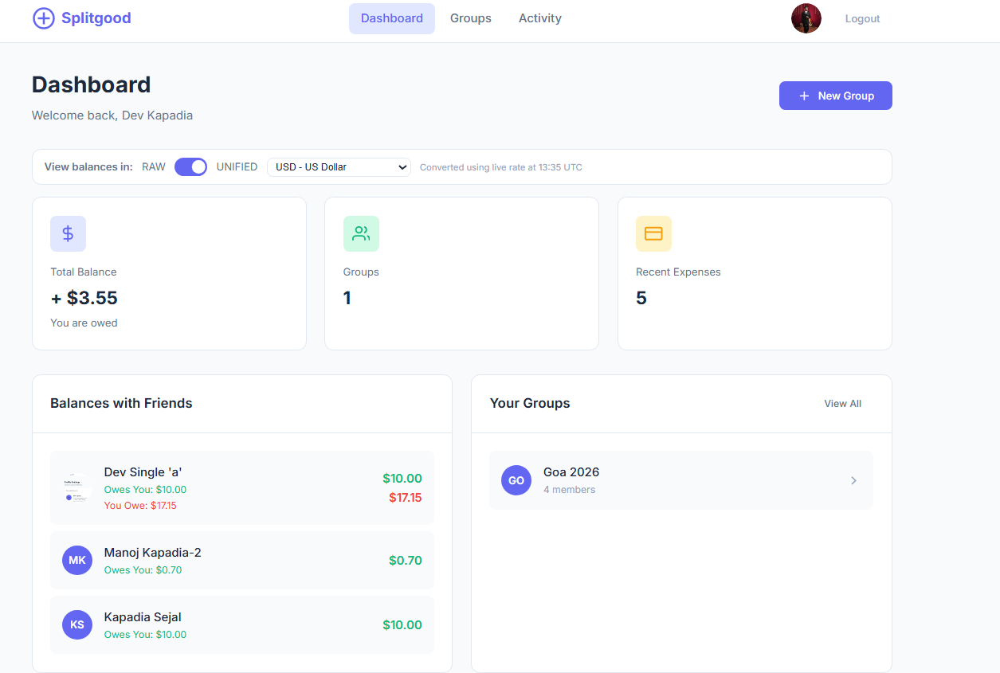

2. Group View - Multi-currency to $ Conversion:
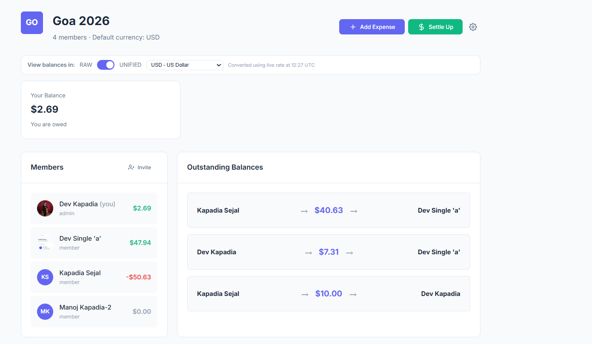

3. Group View - Multi-currency to INR Conversion:
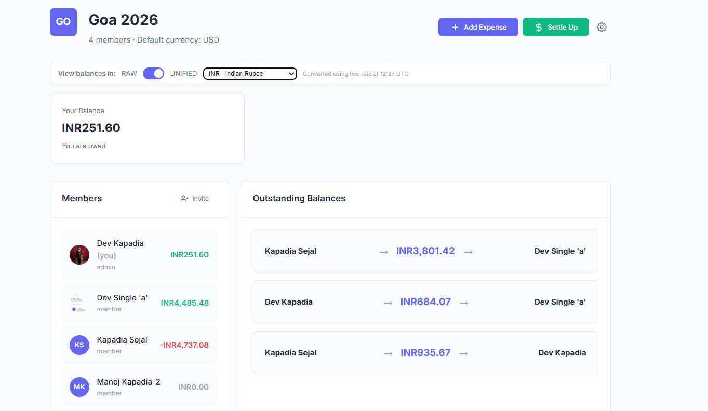


## Recent useful Changes

- RAW/UNIFIED currency toggle with live FX rates
- Shows per-currency balances exactly as stored, separate lines for each currency
- Converts all currencies to user-selected target currency using live FX rates, merges per-user-pair balances
- In RAW mode, internally converts multi-currency balances to USD to determine overall sign (positive/negative/zero) for color coding
- GREEN = positive (owed to you), RED = negative (you owe), neutral = settled; applies globally on dashboard and group pages
- Unified view is purely UI-only, never persists converted values, always recomputes from raw ledger
- Settle Up page has no toggle, always operates in RAW currency mode
- No account creation via phone. If phone not registered, user sees "Please sign up first" error. Removed `phone_set_name` view and route entirely.
- Email field is locked/disabled on profile page. Cannot be changed.
- Clicking "Edit" opens a modal with country code + phone input. Uniqueness check before OTP send. OTP must verify before phone is saved. Old number replaced atomically.
- Registered users are auto-added to groups immediately (status='accepted'), no pending state
- Unregistered invitees get placeholder accounts; when they sign up, all ledger data (expenses, shares, payments, activity) is atomically transferred and placeholder is deleted
- Traditional Signup: Name (required), email, phone (required) with country code, password → OTP phone verification → account creation
- New OAuth users must verify phone number via OTP before account creation; sets is_oauth_only=True
- Atomic reassignment of all ExpenseShare, Payment, Expense, Activity from placeholder_user to real_user when invite accepted
- django-allauth integration with auto-merging by email via CustomSocialAccountAdapter
- Full flow (send code, verify, set name) with Twilio integration and graceful degradation
- Radio button channel selection (email/phone), dummy name requirements, PersonIdentity records for unregistered users
- Database backend for async notifications (invites, expenses, payments, daily reminders, weekly summaries)
- Expense tracking with 3 split strategies
- Balance calculation and settlement suggestions
- Activity feed and commenting
- Modern responsive UI with CSS custom properties


## 📱 OTP Authentication Limitation (Twilio Trial Account)

This project uses **Twilio** for OTP-based phone number verification and it is mandatory for all.

### ⚠️ Important Note

Currently, the application is configured with a **Twilio Trial Account**, which imposes the following restriction:

* OTP messages can only be sent to **verified phone numbers**
* During Twilio account setup, only specific numbers are pre-approved
* Any unverified number will **not receive OTPs**

---

## Current Flow (Due to Twilio Trial)

1. User enters phone number during registration
2. Backend attempts to send OTP via Twilio
3. ❌ If number is not verified → OTP delivery fails
4. ✅ Only pre-verified numbers receive OTP successfully

---

## Demo Access Workaround

To test the application during demo:

👉 Please share your phone number via:

* 📧 **[dev18.kapadiaa@gmail.com](mailto:dev18.kapadiaa@gmail.com)**

Once received:

* The number will be added to Twilio’s verified list from backend
* OTP authentication will start working for that number

---

##  Important Clarification

> This limitation is **not a project constraint**, but a restriction imposed by Twilio's free trial plan.
> In production, upgrading Twilio removes this restriction and enables OTP delivery to any valid phone number globally.

---


